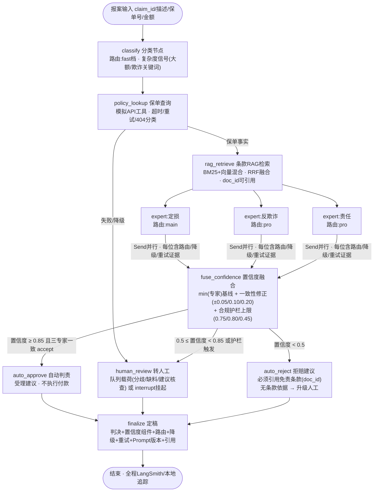
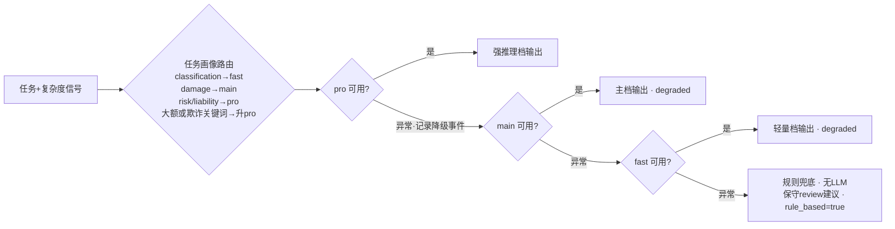
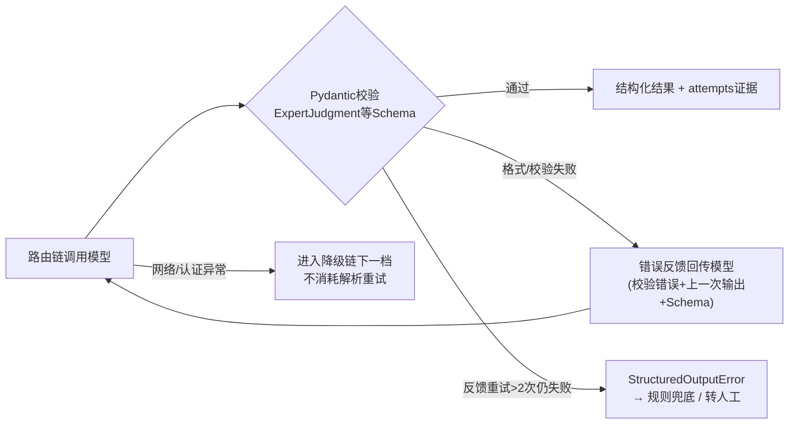

# 进阶改造：保险判责 Agent 三方向深度升级

本文档记录在课堂版判责 Agent（`agents/claim_agent.py` 状态机 + `tools/` 工具集）基础上的进阶改造：**功能叠加、链路改造、优化增强**三个方向组合落地，全部代码可离线运行，`--live` 时接入 `.env` 配置的真实模型端点。

- 改造代码：`advanced/`（见下文目录结构）
- 快速验证：`python -m advanced.run_demo`（离线全场景）、`python -m advanced.run_demo --eval`（评测）、`python -m advanced.run_demo --live --scenario auto`（真实模型）
- 测试：`tests/test_advanced_components.py`、`tests/test_advanced_workflow.py`（27 项，全套 146 项通过）

---

## 一、改造总览：改了什么 / 为什么 / 带来什么提升

| # | 方向 | 改造项 | 改了什么 | 为什么 | 带来什么提升 |
|---|------|--------|----------|--------|--------------|
| 1 | 一 | 模拟保单查询 API（`advanced/mock_policy_api.py`） | 新增独立 FastAPI 服务：5 张合成保单（有效/过期/免责命中/低限额/高频出险）、出险历史接口、`fail_rate/latency` 故障注入、健康检查 | 课堂版 `DemoBackend` 是进程内单例、只有一张保单，无法验证工具层的超时、重试、降级与 404/5xx 分支 | 工具链路可在真实 HTTP 语义下测试；故障注入让降级演练不需要真停服务 |
| 2 | 一 | 保单查询工具（`advanced/policy_api_tool.py`） | `PolicyApiClient`（httpx，超时+有限重试，4xx 不重试 5xx 重试）+ LangChain `@tool` 封装（`ToolException` 显式失败） | 任务要求"接入新工具（模拟 API 即可）"；同时课堂版工具只包进程内字典，没有网络语义 | Agent 可在 tool-calling 模式绑定 `query_policy_api`；判责图经该工具取保单事实，失败可观测可降级 |
| 3 | 一 | 模型路由 ModelRouter（`advanced/model_router.py`） | 任务画像（classification→fast、liability/risk→pro…）+ 复杂度升档（大额/欺诈关键词→pro）+ 每次路由记录决策链与理由 | 课堂版 `config.MODEL_ROUTING` 是静态查表，不随案件复杂度变化，也没有路由证据 | 简单案件用轻量档省成本、复杂案件升强推理档保质量；每个判决都能回答"用了哪个模型、为什么" |
| 4 | 二 | LangGraph 多节点判责工作流（`advanced/judge_graph.py`） | 课堂版状态机上叠加：`classify → policy_lookup → rag_retrieve → experts(Send并行) → fuse_confidence → 三分流出口 → finalize` | 课堂版没有 RAG 节点、没有低置信出口；判责证据与保单事实没有进入同一条图链 | 单步/状态机变成可审计的流水线：每个节点的输入输出、路由、降级、重试都进最终判决记录 |
| 5 | 二 | RAG 条款检索（`advanced/clause_store.py` + `data/clauses/`） | 教学合成条款库（12 条，含免责/效力终止条款）+ 进程内混合检索（字符 bigram TF-IDF 向量 + BM25，RRF 融复用课堂版 `HybridRetriever` 抽象） | 课堂版 RAG 绑定 Milvus，联调要基础设施；作业要求判责链路具备条款检索能力 | 零依赖可跑的条款检索，检索结果带 `doc_id` 可引用；生产把 `vector_search` 换成 `ClaimVectorStore` 即可，融合逻辑零改动 |
| 6 | 二 | 置信度阈值三分流（`judge_graph.fuse_confidence` + 条件边） | 高置信（≥0.85）→ 自动判责；中置信（0.5–0.85）→ 转人工（队列或 `interrupt` HITL）；低置信（<0.5）→ 拒赔建议（必须引用免责条款，否则升级人工）。阈值可配置（`TriageThresholds`） | 第四章核心逻辑落地；课堂版只有 review/auto 两档，且低置信没有明确出口 | 自动判责、人工审核、拒赔建议三路清晰；配合护栏规则，分流原因完整可追溯 |
| 7 | 三 | LangSmith 追踪 + 本地链路追踪（`advanced/tracing.py`） | `setup_tracing()` opt-in 开关：配置 `LANGSMITH_API_KEY` 时重新打开 LangChain 上报（课堂版在 `config.py` 里显式关闭了它）并指定项目；未配置时 `LocalTraceCollector` 按运行树记录链/LLM/工具事件 | 模块 03 要求链路追踪；同时不能默认外泄请求数据、离线也要能看链路 | 同一份代码：有 Key 走 LangSmith 全链路可视化，无 Key 打印本地轨迹表，演示/CI 零依赖 |
| 8 | 三 | Eval 评测数据集 + 运行器（`advanced/evals.py` + `evals/judge_dataset.jsonl`） | 7 个黄金标注案件（auto×2 / review×3 / reject×2），离线跑全图输出准确率+混淆矩阵+分档 P/R；配置 Key 时自动上传 LangSmith 数据集与逐案结果；`--live` 可切真实模型评测 | 判责阈值/护栏是业务参数，必须有回归评测；课堂版没有判责终态的数据集 | 改阈值、改护栏、换 Prompt 都能立刻看到分流结果变化（离线确定性，CI 可用） |
| 9 | 三 | Prompt 模板版本化（`advanced/prompt_versioning.py` + `prompts/versions/`） | 注册/激活/金丝雀/回滚 + 内容哈希 + 渲染审计（谁在哪个节点用了哪个版本）；版本文件不可变、状态可流转、跨进程持久化 | 模块 04 要求；课堂版 `PromptRegistry` 只能按版本存取，没有生命周期 | 判责结果可归因到确切 Prompt 版本（`1.0.0@哈希`）；坏版本一键回滚，不重发代码 |
| 10 | 三 | 模型降级兜底链（`model_router.ainvoke` + `services` 规则兜底） | 降级链 pro→main→fast→**规则兜底（无 LLM，保守 review）**，逐档记录降级事件；解析重试失败也落规则兜底 | 课堂版只有"主模型失败→fast"一跳；链路全挂时没有最终答案 | 任何模型故障最终都产出保守可用的判责建议（转人工），且降级证据进判决记录，不静默 |
| 11 | 三 | 结构化输出校验自动重试（`advanced/structured_retry.py`） | 解析失败 → 把校验错误回传模型 → 重新生成 → 再校验（≤2 次反馈重试）；网络错误不消耗重试；最终失败抛 `StructuredOutputError` 走降级 | 模块 06 要求；课堂版 `SafePydanticOutputParser` 依赖注入修复函数，没有"带着错误重问模型"的闭环 | 模型输出格式问题自动收敛，脏 JSON 不再直接打断判责；重试次数与错误进审计 |
| 12 | 加分 | 与实际业务结合 | 见下文第三节 | | |

---

## 二、流程图

### 2.1 判责主链路与置信度三分流（Mermaid）



**分流规则（对应第四章核心逻辑）**：高置信度 → 自动判责；中置信度 → 转人工审核；低置信度 → 拒赔。阈值默认 `high=0.85 / mid=0.50`，由 `TriageThresholds` 配置，评测数据集可回测。

**合规护栏（优先于阈值，全部记入 `triage_reason`）**：
- 保单查询降级/缺保单号 → 人工（系统风险不自动决定）；
- 保单失效 / 报案命中免责标记 → 置信度上限 0.45（走拒赔建议 + 条款引用）；
- 专家指出缺材料 → 上限 0.75；索赔超保额 → 上限 0.80；有专家建议调查 → 上限 0.80（都收敛到人工）；
- 自动拒赔检索不到免责条款 → 升级人工（"不能无依据拒赔"）。

### 2.2 模型路由与降级兜底链



### 2.3 结构化输出校验自动重试（与降级链正交组合）



---

## 三、与实际业务需求的结合点（加分项）与思考过程

**业务画像**：产险理赔审核的现实痛点是"两高一长"——人工审核成本高、无依据拒赔投诉风险高、简单案件处理周期长。这套改造直接对应四件事：

1. **直赔率（自动化率）**：高置信自动判责把"材料齐全+责任明确+小额"的案件从人工队列里拿走。真实运行里这类案件占比通常最高，每提升一个点的直赔率都是审核人力的直接释放。`route` 决策与 `finalize` 判决记录让"为什么这台机器敢自动放行"对运营和监管都可解释。
2. **人工审核效率**：中置信案件的 `human_queue` 载荷不是一句"转人工"，而是结构化任务卡——三位专家各自的建议与置信度、分歧点、缺失材料清单、建议核查项。审核员打开就能干活，而不是重新读一遍全案。
3. **拒赔合规**：无依据拒赔是投诉和监管处罚的重灾区。低置信出口强制引用免责条款（`doc_id` 可回溯到条款原文），检索不到条款就升级人工——把"机器不能无据拒赔"写进控制流而不是写进口号。真实生产中拒赔决定发出前仍保留授权人工复核位（代码与输出都明确标注）。
4. **稳定性与成本**：模型路由让强推理只花在判责核心（liability/risk），分类等轻任务走轻量档；降级链保证模型侧任何故障都收敛到"保守转人工"而不是报错白屏；结构化重试保证输出能进核心理赔系统而不需要人工清洗。

**思考过程（为什么这么改）**：
- 课堂版已是 LangGraph 状态机，但没有 RAG 节点、没有低置信出口，保单事实与条款证据没进同一条链 → 把它们编进图节点而不是旁路调用，证据链才完整。
- 课堂版 RAG 绑 Milvus，教学/CI 场景跑不起来 → 复用 `HybridRetriever` 抽象做进程内实现：离线可跑，生产只换检索后端，融合逻辑不动。
- 课堂版显式关闭了 LangSmith（选型 LangFuse）→ 做成 opt-in：有 Key 上 LangSmith，无 Key 本地轨迹表，同一份代码两种观测形态。
- 课堂版解析修复靠调用方注入函数 → 升级为"带着校验错误重问模型"的真实闭环，并区分网络错误（走降级）与格式错误（走重试），两类失败不互相伪装。
- 评测先行：改阈值/护栏/Prompt 之前先有数据集和准确率基线，避免"拍脑袋调参"。

---

## 四、目录结构

```text
claims-ai-agent/
├── advanced/                        # 进阶改造包（本作业主体）
│   ├── __init__.py                  # 包导出
│   ├── mock_policy_api.py           # 方向一：模拟保单查询API（FastAPI·多保单·故障注入）
│   ├── policy_api_tool.py           # 方向一：保单工具（httpx客户端 + LangChain @tool）
│   ├── model_router.py              # 方向一/三：模型路由 + 降级链 + 规则兜底
│   ├── clause_store.py              # 方向二：条款RAG（进程内混合检索，复用HybridRetriever）
│   ├── judge_graph.py               # 方向二：LangGraph多节点判责图 + 置信度三分流 + HITL
│   ├── schemas.py                   # 结构化契约（分类/专家意见/分流说明）
│   ├── services.py                  # 服务层：OfflineJudgeServices / LiveJudgeServices
│   ├── prompt_versioning.py         # 方向三：Prompt版本管理（注册/金丝雀/回滚/哈希审计）
│   ├── structured_retry.py          # 方向三：结构化输出校验失败自动重试
│   ├── tracing.py                   # 方向三：LangSmith opt-in + LocalTraceCollector
│   ├── evals.py                     # 方向三：评测运行器（准确率/混淆矩阵/可选上传）
│   └── run_demo.py                  # CLI演示入口（--scenario/--eval/--live/--trace）
├── data/clauses/motor_commercial_v3.md   # 教学合成条款库（12条：责任/免责/理赔/争议）
├── evals/judge_dataset.jsonl             # 评测数据集（7案·三分流黄金标注）
├── prompts/versions/                     # Prompt版本持久化目录（首次运行自动播种）
├── tests/test_advanced_components.py     # 组件测试（路由/重试/版本/RAG/工具）
├── tests/test_advanced_workflow.py       # 工作流测试（三分流/护栏/HITL/评测）
└── docs/advanced-upgrade.md              # 本文档
```

与课堂版的关系：`agents/`、`tools/`、`models/`、`prompts/`（原文件）等模块未被修改，进阶能力全部增量在 `advanced/` 包内并复用既有抽象（`HybridRetriever`、`Contract`、`ClaimLLMFactory`）。

---

## 五、运行指南

```bash
source .venv/bin/activate

# 1) 离线全场景演示（默认，无任何外部依赖；自动启动模拟保单API:8010）
python -m advanced.run_demo
python -m advanced.run_demo --scenario reject_exclusion   # 单场景
python -m advanced.run_demo --scenario auto --trace       # 附本地链路追踪明细

# 2) 评测数据集（离线确定性；输出准确率+混淆矩阵）
python -m advanced.run_demo --eval

# 3) live真实模型（需.env配置模型端点；本仓库当前为GLM OpenAI兼容端点）
python -m advanced.run_demo --live --scenario auto

# 4) LangSmith追踪（可选）
export LANGSMITH_API_KEY=ls__xxx
python -m advanced.run_demo --eval          # 追踪+评测结果自动上传LangSmith

# 5) 独立启动模拟保单API（供其他系统/课程演示调试）
python -m advanced.mock_policy_api --port 8010 --fail-rate 0.5   # 50%故障注入

# 6) 测试
python -m pytest tests/test_advanced_components.py tests/test_advanced_workflow.py -q
python -m pytest -q                                            # 全套（含课堂版回归）
```

---

## 六、验证记录（本机实测）

| 验证项 | 结果 |
|--------|------|
| 组件+工作流测试 | 27/27 通过 |
| 全仓库测试（含课堂版回归） | 146 通过 / 1 跳过（Milvus 集成需基础设施） |
| 离线评测（7案三分流） | 准确率 7/7 = 100%，混淆矩阵对角线满 |
| live 模型路由（GLM端点） | classification→fast、damage→main、risk/liability→pro 全部按画像路由；材料齐全案件置信度 0.95 → 高置信自动受理 |
| live 模型诚实行为 | 仅文本描述（无单证附件）时，真实专家主动列出缺失票据/照片 → 缺材料护栏 0.75 → 转人工（符合预期，不是缺陷） |
| 故障注入降级 | 保单API 100% 503 → 客户端重试后显式降级 → 图路由人工队列（`policy_error` 入判决） |
| HITL | interrupt 模式：中置信挂起 → resume 无据拒赔被拒（必须条款依据） → 合法 accept 恢复完成 |

## 七、边界与合规说明

- 所有输出都是**审核建议**：自动受理不执行付款，自动拒赔在真实生产仍需授权人工复核后发出。
- 模拟保单 API、条款库、离线专家意见全部是**教学合成数据**，输出中显式标注 `demo=true` 与来源，不冒充业务事实。
- LangSmith 上报默认关闭，仅在显式配置 `LANGSMITH_API_KEY` 后开启；本地追踪不上传任何数据。
- 分流阈值（0.85/0.50）与护栏上限是教学默认值，生产应基于历史案件回测校准（评测运行器即为此准备）。
